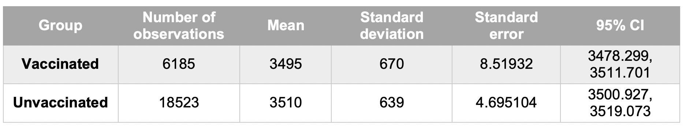

```{r setup, include=FALSE}
knitr::opts_chunk$set(echo = TRUE)
```

***
### Learning objectives

This module provides an introduction to the R statistical package. On completion of this module you should:


1. Have an understanding of basic features of the R statistical program 
2. Be familiar with the R environment 
3. Be able to undertake basic R commands to input, view, describe and save data 
4. Be able to generate basic graphs 
5. Have an understanding of the requirements for data checking and data cleaning 
6. Be able to undertake manipulation of variables, including dates 
7. Be able to undertake manipulation of datasets, such as appending, merging and reshaping

***

#### Textbook 
+	Kirkwood B and Sterne J. Essential Medical Statistics, 2nd Edition. May 2003, ©2003, Wiley-Blackwell. 

#### References 
+	Donegan K, King B and Bryan P. Safety of pertussis vaccination in pregnant women in UK: observational study. BMJ 2014;349:g4219 doi: 10.1136/bmj.g4219 (Published 11 July 2014). 

+	Gregoire AJ, Kumar R, Everitt B, Henderson AF, Studd JW. Transdermal oestrogen for treatment of severe postnatal depression. Lancet. 1996 Apr 6;347(9006):930-3. 

+ Rabe-Hesketh S and Everitt B. A Handbook of Statistical Analyses Using R; Fourth Edition. 2007, Chapman & Hall/CRC. 

+ Spanos A, Harrell FE, Durack DT. Differential diagnosis of acute meningitis: An analysis of the predictive value of initial observations. JAMA, 1989; 262: 2700-2707. 

#### Datasets 

##### *Meningitis data* 
+ meningitis.csv dataset: dataset in csv (comma delimited) format 

##### *Pertussis data*
+ pertussis.csv 

##### *Dates data*
+ date exercise.csv: date exercise in csv (comma delimited) format 

##### *Postnatal depression data* 
+	depress1a.csv
+ depress1b.csv 
+ depress2.csv 
+ depress3b.csv 
+ depress4_5.csv 
+ depress6a.csv 
+ depress6b.csv 


``` {r, include=FALSE}
if (!require(psych)) {
    install.packages("psych")
    require(psych)
}
if (!require(ggplot2)) {
    install.packages("ggplot2")
    require(ggplot2)
}
``` 

### Introduction to R and Describing Data

R is a very powerful, and relatively easy to use Statistical package which allows you to undertake data management and manipulation, perform a range of basic and complex statistical tests and analyses, and generate a wide variety of different graphs. For this course, you will be required to use R to undertake basic analysis and graphics.

R is a dialect of the S language. It is a case-sensitive, interpreted language. You can enter commands one at a time at the command prompt (>) or run a set of commands from a source file. There is a wide variety of data types, including vectors (numerical, character, logical), matrices, data frames, and lists. Most functionality is provided through built-in and user-created functions and all data objects are kept in memory during an interactive session. Basic functions are available by default. Other functions are contained in packages that can be attached to a current session as needed.

R packages are bundles of functions which extend the capabilities of R. Thousands of add-on packages are available in the main online repository (CRAN) and several more packages can be found on GitHub. These packages can be found and installed online. 

Stata and R have minor difference in default setting and methods. In this document, we will follow the Stata analysis as closely as possible, but small and usually important difference in Stata and R will be noted. Unlike Stata, R can hold multiple datasets in memory simultaneously and so, there is no need to save intermediate files or close and re-open datasets. 

You need to communicate with R in a way that the program understands; i.e. you need to be able to tell R what you want in a way that it understands. You can do this by typing in commands using an appropriate “language”.

Syntax, also sometimes referred to as “code” or “programming”, refers to the grammatical rules that you need to follow so that R understands what you want it to do. Syntax does not necessarily follow rules of English grammar! You tell R to do something by using the correct command or set of commands. An R command is a combination of syntax elements, expressed following the rules of ‘R language’. 


### R Studio

R Studio is an integrated development environment (IDE) for R. It includes a console, syntax-highlighting editor that supports direct code execution, as well as tools for plotting, history, and debugging and workspace management.  It is available in open source and commercial editions on the desktop (Windows, Mac, and Linux) and from a web browser to a Linux server running R Studio Server or R Studio Server Pro. In this course, we will be using R Studio. The R Studio environment is similar to the Stata environment and we hope will help ease the transition from Stata to R. 

Ensure you have the latest [Java](https://www.java.com/en/download/) installed. Download and install [R](https://cran.r-project.org/) and [RStudio](https://www.rstudio.com/products/rstudio/download/)

### The R Program 

Open the R program using RStudio by double-clicking on the icon (as you would open any other program that you are familiar with).

```{r, fig.align='center', out.width = "100px", echo=FALSE}
knitr::include_graphics("fig1_Ricon.png")
```

### RStudio Interface

The diagram below shows the open RStudio program; you will see that there are various different components or windows. The R windows are: 

+ R Script– where you type in R commands one by one (visible once you open or create a new R scropt file) 

+ Console window – this shows a log of everything you do in R session, including commands and results of these commands 

+ History – keeps a record of every command you enter in R session 

+	Environment–stored all the datasets, arrays, lists and variables created in R

+	Figures – Displays all plots and figures created in R. You can use the arrows to move between images. The export option can be used to save the plots as pdf or image, or to copy plots to clipboard. 

+ Packages – you can select the packages to be installed from the list of packages 

```{r, fig.align='center', out.width = "750px", echo=FALSE}
knitr::include_graphics("fig2_Rstudio_screenshot.png")
```

### RStudio Menu 

On the top left hand side of the screen you will see the set of R icons.


```{r, fig.align='center', out.width = "750px", echo=FALSE}
knitr::include_graphics("fig3_Rstudio_screenshot_2nd.png")
```


    On your computer, identify: 
    1. the R console
    2. the R script
    3. the R environment
    

### Datasets

The first dataset we will be using has been modified from a dataset for 581 patients with acute meningitis (Table 1). Data from a subset of 422 patients were used to examine factors associated with differentiating between acute viral or acute bacterial meningitis^[Spanos A, Harrell FE, Durack DT. Differential diagnosis of acute meningitis: An analysis of the predictive value of initial observations. JAMA, 1989; 262: 2700-2707]. The original dataset can be found at: http://biostat.mc.vanderbilt.edu/wiki/pub/Main/DataSets/Cabm.html

The dataset is available as **meningitis.csv** dataset: A comma delimited Excel file which can be imported into R or other statistical programs; this type of file has a .csv extension. 


**Table1:**  Format of meningitis dataset

```{r, fig.align='center', out.width = "750px", echo=FALSE}
knitr::include_graphics("table1_formatting.png")
```


## Opening data 

### Creating a new project

Create a new R project under “File > New Project…” and select “New Directory > New Project” (noting file path so that you know where to save .csv files etc. on your computer). 

The project file name you just created will end in .Rproj. Locate the folder containing this file. This will be your working directory.  This method is recommended each time you are working on a new project. 

Save all .csv files to the folder containing your .Rproj file (you may need to convert some data files to .csv files). 

### Reading your datasets. 
 
To import data from a .csv file:
This can be done by saving your excel or R file as a .csv file and importing in directly into R 


```{r}
meningitis <- read.csv("meningitis.csv")
```


*Menu driven method:*

You can import data in another format, using the File Menu. These include, csv, excel, SPSS, SAS and Stata files. Click on the File > Import Dataset, and specify the type of file you want to open – for .csv file, specify “From Text (readr)”.

Use the “browse” icon to specify the directory and dataset to be opened.


You can preview the first 50 observation in the dataset and the corresponding code to open the dataset. 

```{r, fig.align='center', out.width = "750px", echo=FALSE}
knitr::include_graphics("fig5_screenshot_4th.png")
```
*Note: the code displayed varies from the one mentioned above. This is an example of the flexibility R provides the user with. There are multiple ways to do the same thing in R.*

The file has the variable names in the first row – you therefore you need to click on this box. 

When you specify the required dataset, R will show you part of the dataset, as shown above. You can see that the first row of the file includes the names of the variables (this will generally be the case for most datasets that you will be working with), and you need to check the box First row as variable names.

    Open the dataset using the read.csv command or File Import Menu. You can play around with opening the different 
    types of datasets. 
    
    What do you see in each of the windows when you open the dataset?

### Browsing your data

R Studio has a nice feature where everything is in one browser window, so you can browse your dataset and your code without having to switch between windows. 

```{r,eval=FALSE }
#to view your dataset 
View(meningitis)
``` 

Alternatively, you can also view your dataset by clicking on “meningitis” in on the top right panel in R studio browser (in the "Environment" panel), as shown below:


```{r, fig.align='center', out.width = "750px", echo=FALSE}

```

      How many variables are there? How many observations? 
      What do you think that the NA values mean? (More on this later!)

### R help function 

The `help()` function and `?` help operator in R provide access to the documentation pages for R functions, data sets, and other objects, both for packages in the standard R distribution and for contributed packages. 
Example: To access documentation for the standard *lm* (linear model) function, for example, enter the command `help(lm)` or `help("lm")`, or `?lm` in R console. Another way is shown below:

```{r, fig.align='center', out.width = "750px", echo=FALSE}
knitr::include_graphics("fig7_screenshot_6th.png")
```


### R Commands vs Menu


So far we have used the menus to do what we want in R as well as typing the command directly into the console and then pressing the enter key (note that no commands will be read by R until you have hit enter). You may have noticed that when you use the menus, the commands actually appear in the console. This is very helpful as you can clearly see what commands you have undertaken, and can also enable you to copy and save commands into a file which you can later review or run again. Unlike Stata, R is more command driven than menu driven and the menu-driven methods allow for limited functions in R. 

Almost everything in R is done through functions. A function is a piece of code written to carry out a specified task; it may accept arguments or parameters (or not) and it may return one or more values (or not!). The core of R is an interpreted computer language which allows branching and looping as well as modular programming using functions. R allows integration with the procedures written in the C, C++, .Net, Python or FORTRAN languages for efficiency.


**Table 2:** Some commonly used R commands

```{r, fig.align='center', out.width = "750px", echo=FALSE}

```

### The summary command

    1. Type the word summary(dataset) in the console and press enter. 
    What has happened? How many variables are there? How many observations?

    2. Type summary(sex) into the command bar. 
    How is this result different to the one above?
    

### Variable Types 

Variables in R can contain numbers or strings (characters which can be letters or numbers, or sometimes other special characters). String variables can be up to 244 characters long. Numeric variables are stored either as integers (bytes, integers or longs) or floating point (float or double). The variable type is listed under the second column in the `str()` command output. You can check the length of the character variables using the `nchar()` command. 
 
It is important to be familiar with different types of variables and the way they are stored in R. Some analyses require that data be stored as numeric rather than string variables. This means for example that sex is better stored as numbers (e.g. 0 or 1) rather than string variables (ie “female” or “male”). 

While storing variable values as numbers is important for analysis, we need to be know what each of these values represent; for example if we code sex as 0 or 1, which value represents males and which females? We need to have a data dictionary, which “translates” the numeric values in to character labels. You can label the numeric values of a variable in R so that the words rather than the numeric values are displayed; the numeric values will be retained for analysis purposes. We will discuss this later.

    Type dataset_name in the console and press enter. What does this show? 
    Type dataset_name$var1 then press enter. What does this show?


### Summarising and Describing Data

Tabulating data: 

```{r, eval=FALSE}
#attach the dataset before analysis
attach(meningitis_csv_dataset)
table (sex)

# or you can avoid the 'attach(dataset)' by using the '$' operator to specify which dataset the variable comes from:
table(meningitis$sex)
````

    What does the results window show? How many males and females are in the data set? 

### Two-Way Table

```{r, eval=FALSE}

tab <- table(meningitis$sex, meningitis$abm)
tab

margin.table(tab, 1) # A frequencies (summed over B)
margin.table(tab, 2) # B frequencies (summed over A)

prop.table(tab) # Cell percentages

prop.table(tab,1) # Row percentages

```

    We have previously generated the table of acute bacterial meningitis by sex, with row percentages (ie the percentage of males and females who had acute bacterial meningitis). Now use R commands to generate column percentage; 
    i.e. the % of those with and without acute bacterial meningitis who were female.

### The Summary Command

One method of obtaining descriptive statistics is to use the summary command and follow it with the `sapply( )` function with a specified summary statistic (e.g. SD).

```{r, eval=FALSE}
sapply(meningitis$wbc, sd, na.rm=TRUE)
```

Other possible functions used in sapply include mean, var, min, max, median, range, and quantile.

Alternatively, you can also use `describe()` command available in `library(psych)` - after first downloading the package under Packages tab > install, in the bottom right hand RStudio window.

    What is the minimum, maximum, mean, standard deviation and median value for blood glucose? 

```{r, eval=FALSE}
library(psych)
describe(meningitis$bloodgl)
```

### The order command 

The `order` command allows you to arrange the observations in the dataset in increasing or decreasing order of a particular variable, or set of variables. For example you may want to sort the observations in order of patient id number 

The default method of sorting is in ascending order. To sort in decreasing order a minus sign (ie “-“) must be placed in front of the variable to be sorted.  To preserve the original dataset, we create two new datasets (m1) and (m2) where:

m1 is the dataset where we have sorted the original dataset in ascending order of variable “casenum”.

m2 is the dataset where we have sorted the original dataset in descending order of variable “casenum”.

You can confirm this by viewing both datasets, as shown below. 

``` {r, eval=TRUE, echo=TRUE}
m1 <- meningitis[order(meningitis$casenum),]
head(m1, n=10) # selects first 10 rows for you to view - observe the order of the variable "casenum"

m2 <- meningitis[order(-meningitis$casenum),]
head(m2, n=10)
```

    What has now happened to the observations?


Multiple variables can be used to sort the observations. For example, a dataset includes individuals with more than one record, such as baseline data and data for two follow-up visits, we could sort by patient and id and then visit number (or date). We can sort one (or more) variable in increasing order and another (or more) in decreasing order. When we list more than one variable for sorting, observations are sorted by the first variable and then for each value of the first variable, observations are ordered by the second variable, and so on. You can sort by any type of variable – continuous, categorical, and binary or string.

    Sort the observations by increasing year of admission and then by increasing age, and look at the data. Now sort by increasing year of admission and decreasing age and see what has happened. Sort by CSF glucose within sex. How has R dealt with missing values?


Some procedures require that the data be sorted by particular variable/s. The menus will often undertake a data sort for many procedures requiring sorted data, however using R code / commands may still require you to sort the data before performing a particular procedure or operation; If that is the case R will give you an error message specifying that the data have not been sorted.


### To Repeat Commands by Groups. 

R doesn’t use the if and by command as STATA to repeat commands across groups. It is done differently as shown below. 

To produce the separate tables of acute bacterial meningitis for males and females, we can tabulate abm with sex as we did above:

```{r, eval=TRUE}
table(meningitis$abm, meningitis$sex)

# to make it easier to interpret, we can add table labels: 

table(abm=meningitis$abm,sex=meningitis$sex)

```

    Does acute bacterial meningitis appear to be higher for males or females? Does R account for missing values? 


Table ignores missing values. To include NA as a category in counts, include the table option `exclude=NULL` if the variable is a vector. If the variable is a factor you have to create a new factor using `newfactor <- factor(oldfactor, exclude=NULL)`.

If we are interested in obtaining summary statistics on white blood count for females, we can use the summarize command (without and with the detail option):


```{r, eval=TRUE}
summary(meningitis$wbc[meningitis$sex==1])

```

Note that  we have to specify two equal signs: == not =. Double equal signs are always required for such commands. This is one of the syntax rules of R and the command won’t run if this is not specified correctly.

You can also use the above command to specify a range of values to be included in the analysis: 

```{r, eval=TRUE}
table(meningitis$abm[meningitis$wbc>=5 & meningitis$wbc<=10])

```

    What is the mean CSF protein for participants aged between 20 and 70? 
    What proportion of white females had acute bacterial meningitis? 

```{r, eval=TRUE}
summary(meningitis$pr[meningitis$age>=20 & meningitis$age<=70])

t <- table(meningitis$sex, meningitis$abm, meningitis$race==2)
prop.table(t,1)*100

```


### The keep and drop commands

In R, its is easier to keep the variables than drop them. There is no keep command, but we can specify the variables you want to retain in the dataset. It is always better to create a new dataset with the fewer variables than modify the existing dataset. 

There are 3 major ways to do this in R

##### Select variables v1, v2, v3
`myvars <- c("v1", "v2", "v3")` 

`newdata <- mydata[myvars]`

##### Another method
`myvars <- paste("v", 1:3, sep="")`

`newdata <- mydata[myvars]gc`

##### Select 1st and 5th thru 10th variables
`newdata <- mydata[c(1,5:10)]`

Example: you can subset the meningitis dataset as:

```{r, eval=FALSE}
Meningitis1 <- meningitis[c(1:11,13:14)]

```

To drop or exclude variables, you can use the following syntax: 

##### Exclude variables v1, v2, v3
`myvars <- names(mydata) %in% c("v1", "v2", "v3")`

`newdata <- mydata[!myvars]`

If we have a very large dataset and want to retain only a small number of variables then the keep statement would be more efficient.  

##### To remove observations with particular characteristics

For example if want a dataset which only includes meningitis patients aged less than 20 we could use either of the following statements:


```{r, eval=FALSE}
newdata <- meningitis[ which(meningitis$age <20 ),]

```


#### Generating Graphs

Graphs are a very useful way of summarising and describing data, and enable you to look at the shape of the distribution. R has very good graphics packages including `ggplot2`. 


##### Histograms
We will first generate a histogram for white blood count (WBC). 


```{r}
# The below code generates a histogram
hist(meningitis$wbc, freq = FALSE, breaks = 17, xlim = c(0,80)) # freq FALSE will plot density on y-axis instead of frequency and xlim sets the range on the x axis to be from 0 to 80, with 17 breaks (bins)

# The below code generates the same histogram but without the breaks specification and x-axis limitation
hist(meningitis$wbc)

```


    What do you think about the distribution for white blood count?
    
    Generate a histogram for blood glucose. What do you think about the shape of the distribution? Regenerate the 
    histogram but add the breaks option and specify 20. What does this do?

    Also note what is the default number of bins specified when we use the `hist()` command alone


If we want to see how close to a normal distribution our histogram is we can overlay a normal curve.

To do this, we first calculate mean and standard deviation for bloodgl. 

```{r}
x <- na.omit(meningitis$bloodgl)
h <- hist(x)
xfit<-seq(min(x),max(x),length=40) 
yfit<-dnorm(xfit,mean=mean(x),sd=sd(x)) 
yfit <- yfit*diff(h$mids[1:2])*length(x) 
lines(xfit, yfit, col="blue", lwd=2)
```

    Generate a graph of CSF glucose with 25 bins and a normal curve overlay. What does this graph show? Does it look reasonable? What might you interpret from this graph?


```{r}
x <- na.omit(meningitis$gl)
h <- hist(x, breaks = 25, xlim = c(0,250))

xfit<-seq(min(x),max(x),length=40) 
yfit<-dnorm(xfit,mean=mean(x),sd=sd(x)) 
yfit <- yfit*diff(h$mids[1:2])*length(x) 
lines(xfit, yfit, col="red", lwd=2)
```

    Using the command line rather than the graphics menu, generate a graph of CSF glucose with a normal curve overlay for: a) males only; b) for participants aged between 15 and 75.

```{r}

#a) 
x <- subset(meningitis, sex==2) # subsetting dataset by males only
x <- na.omit(meningitis$gl) 
h <- hist(x, breaks = 25, xlim = c(0,250) , main = "Histogram of glucose CSF \n for males", xlab = " glucose CSF") # main heading and x-axis titles have been added here
xfit<-seq(min(x),max(x),length=40) 
yfit<-dnorm(xfit,mean=mean(x),sd=sd(x)) 
yfit <- yfit*diff(h$mids[1:2])*length(x) 
lines(xfit, yfit, col="blue", lwd=2)

#b) 

x1 <- na.omit(meningitis$gl[meningitis$age >=15 & meningitis$age<=75])
h <- hist(x1, breaks = 11, xlim = c(0,200), main = "Histogram of glucose CSF", xlab = " glucose CSF")

xfit<-seq(min(x1),max(x1),length=40) 
yfit<-dnorm(xfit,mean=mean(x1),sd=sd(x1)) 
yfit <- yfit*diff(h$mids[1:2])*length(x1) 
lines(xfit, yfit, col="blue", lwd=2)

```


### Scatter plots 

Histograms display variables one at a time. A scatterplot will show the relationship between two continuous variables. We will obtain a scatterplot of heart rate versus mean blood pressure. 

```{r}
#pch command will give sold circles to mark points in a graph
plot(meningitis$gl, meningitis$bloodgl, pch = 19, col = "darkblue")
```


There are a very large range of options in R for specifying the look of the graph, including titles, labelling and defining axes, the colour and shape of the markers (i.e. the points on the graph), legend specification and location, subsetting, putting multiple plots on the same graph, etc. An example of R code to produce a graph of CSF versus blood glucose, separately for males and females is shown below with the corresponding graph.

```{r}
plot(meningitis$bloodgl, meningitis$gl, pch = c(21, 19), col= c("blue", "red")[unclass(meningitis$sex)], main = "Graph of CSF glucose vs blood glucose by sex")

#Add legend
legend(1,195, legend = c("Male", "Female"), col = c("Red","Blue"), pch = c(21, 19), cex = 0.8)

```

    Play around with generation of scatter plots of white blood count versus total leukocytes separately for patients with and without acute bacterial meningitis. Try and change the colour and type of markers, axes, title and legends.


### Saving results and commands 

It is very important to retain a copy of your results so that you, or anyone can check this, and to be able to re-run your analysis at any time. In addition you will often want to, add to, repeat or revise your analyses. You do not want to have to type in your commands or re-do all of the menu analysis again, thus you also should save a copy of all of your commands.


#### Saving graphs 

Graphs are not saved in the results window, or the log file, and need to be individually saved. 

To do this click on Export and save as either Image or pdf. You can also copy the plot onto your clipboard.

```{r, fig.align='center', out.width = "200px", echo=FALSE}

```

This then opens up a black page, something like a Word document, which you can put all of your commands. This is a good strategy, especially when you first start using R. Alternatively, you can also open a new R script using Ctrl+ Shift+ N. 

You can add comments on a line after a hashtag (#) as shown in the R script example below. 

In computer programming, a comment is a programmer-readable explanation in the source code of a computer program. They are added with the purpose of making the source code easier to understand, and are generally ignored by compilers and interpreters.

The `setwd` command at the start of the file tells R to change your working directory to the one specified. This means that you don’t have to specify the directory every time you open or save a file.

```{r, fig.align='center', out.width = "800px", echo=FALSE}

```


    Have a play around with R, using both the icons and command line. Tabulate each of the variables individually; 
    e.g. year. Do all of the values seem reasonable? Are there any unusual or extreme values? Generate some two way 
    tables; e.g. race abm, and look at the relationship between these variables. See what different types of graphs 
    you can generate using the commands. 


### Descriptive Statistics

This section describes how to generate confidence intervals and undertake hypothesis tests using R. 

You can obtain confidence intervals and undertake hypotheses testing using the R package in two ways: 

As for many types of analyses there is more than one command which provide the same/similar results. This section only focuses on how to undertake hypothesis tests in R, and does not consider the appropriateness of the test, nor assumptions checks.

#### Confidence Intervals for a Single Mean or Proportion 


    We want to obtain the 95% confidence interval for mean birthweight for a sample with the following features: 
    o	20 observations 
    o	Sample mean of 3159 grams 
    o	Sample standard deviation of 220 grams 

Unlike Stata, we need to construct the 95% CI for mean. The 95% confidence interval for the population mean can be expressed as:

$$\overline{X}\pm1.96\sigma/\sqrt{n}$$
```{r}
## Descriptive statistics
# 95% CI for mean
n <- 20
xbar <- 3159
sd <- 220

# calculate standard error
se <- sd/(sqrt(n))
E <- 1.96*se
# or alternatively, E <- qnorm(0.975)*se
ci<- xbar + c (-E, E)
ci
```

The 95% CI is (3063, 3255). We are 95% sure that the true (population) mean lies between 3063 and 3255; if we were to undertake this study 100 times, 95 of the CIs would include the true mean.

If we would like a higher level of precision we might want to obtain 99% confidence intervals:

```{r}
## Descriptive statistics
# 99% CI for mean
n <- 20
xbar <- 3159
sd <- 220

# calculate standard error
se <- sd/(sqrt(n))
E <- qnorm(0.995)*se
ci<- xbar + c (-E, E)
ci
```

The 99% CI is (3032, 3286). What is the interpretation of this interval? 

Table 3 shows the birthweight summary statistics by an observational study on the safety of pertussis vaccination in pregnant women in the UK ^[Donegan K, King B and Bryan P. Safety of pertussis vaccination in pregnant women in UK: observational study. BMJ 2014;349:g4219 doi: 10.1136/bmj.g4219 (Published 11 July 2014].

    Calculate the 95% confidence interval for mean birthweight for babies of mothers: 
    a) who were vaccine; and 
    b) who were not vaccinated

**Table1:**  Birthweight summary statistics 

```{r, fig.align='center', out.width = "800px", echo=FALSE}

```

    We want to estimate the proportion (%) of Australian adults who have diabetes with 95% CI. Of a sample of 11247 Australian adults, 844 have diabetes. What is the proportion and 95% CI?

Like the 95% CI for mean, we need to construct the 95% CI for proportion. The 95% confidence interval for the population proportion can be expressed as:


$$\hat{p}\pm z\sqrt\frac{\hat{p}(1-\hat{p})}{n}$$

```{r}
# 95% CI for proportion
n <- 11247
k <- 844
pbar <- k/n

# calculate standard error
se <- sqrt(pbar*(1-pbar)/n)
se # 'prints (shows) the se value
E <- 1.96*se
# or alternatively, E <- qnorm(0.975)*se
ci<- pbar + c (-E, E)
ci
```

The estimate of the proportion of Australian adults with diabetes is 0.075 (or 7.5%) with 95% CI (0.070, 0.080). How do we interpret this CI?

### Using a Dataset 

You can also obtain a confidence interval for a mean for a variable in a dataset. 

#### CI for a Mean

    Open the meningitis dataset in R. We want the 95% confidence interval for mean white blood cell count.

```{r}
# 95% CI for wbc
wbc <- na.omit(meningitis$wbc)
xbar <- mean(wbc) # no need for the meningitis$ as we have created a new wbc above
n <- length(wbc)
sd <- sd(wbc)

# calculate standard error
se <- sd/(sqrt(n))
se
E <- 1.96*se
# or alternatively, E <- qnorm(0.975)*se
ci<- xbar + c (-E, E)
ci
```

The 95% CI is (13.1, 14.6). 

    How would you change the above code to generate the 99% CIs?
